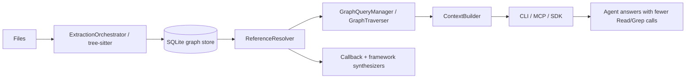

# 本项目有哪些可优化内容

> ZCodeGraph / Architecture Deepening Review  
> Source: `architecture-review-2026-06-08T18-03-08.html`

## 结论

优先不是“再拆文件”，而是把已经承担复杂行为的 **Module** 加深：让调用者面对更小的 **Interface**，把动态补边、Explore 输出规划、索引生命周期这三类复杂度集中到清晰的 **Seam** 后面。

| 维度 | 结论 |
| --- | --- |
| 源码规模 | ~130 TS files |
| 主优化目标 | Agent sufficiency |
| 首选判断法 | Deletion test |
| 建议起点 | Explore planner |

## 当前架构地图

优化的北极星不是“图更完整”本身，而是 **Agent 是否因为 CodeGraph 的输出足够完整而停止继续 Read/Grep**。因此最有价值的 **Depth** 来自输出规划、动态派发补边和索引生命周期的可验证收敛。

---

## Candidate 1: Explore response planner / output budget Seam

**Recommendation strength:** Strong

### Files

- `src/mcp/tools.ts`
- `src/context/index.ts`
- `src/context/formatter.ts`
- `docs/design/adaptive-explore-sizing.md`
- `docs/benchmarks/call-sequence-analysis.md`

### Problem

`zcodegraph_explore` 的 ranking、flow spine、source rendering、skeletonization、staleness banner、tool description 与 Agent sufficiency 策略散在 MCP handler 和 context builder 周边。

当前 **Module** 有真实价值，但 **Interface** 对维护者不够深：要理解一个 Explore answer 为什么够用，需要在多个位置追踪预算、排序和渲染规则。

### Solution

把 Explore answer 生成视为独立的深 **Module**：输入 query + graph + budget + freshness，输出 planned response sections。

MCP 只做 **Adapter**；ContextBuilder 可保留底层能力，但 Explore planner 拥有“哪些文件进 full source、哪些 skeletonize、哪些 flow edge 必须解释”的策略。

### Benefits

- 提高 **Locality**：Agent sufficiency 规则集中，benchmark 失败时不用在 MCP/context/formatter 间跳。
- 提高 **Leverage**：调用者只请求一个 plan，不需要知道 ranking、budget、staleness 的组合顺序。
- 测试改善：可用 deterministic fixture 测 planner 输出，而不必跑完整 MCP。

### Before / After

**Before: broad Implementation knowledge**

- ToolHandler
- ranking + schema
- stale banner
- ContextBuilder traversal
- formatter/source render

**After: smaller Interface, better Locality**

- MCP Adapter
- ExplorePlanner Interface
- ranking policy
- budget policy
- render plan
- freshness note

---

## Candidate 2: Dynamic dispatch synthesizer registry / Seam

**Recommendation strength:** Strong

### Files

- `src/resolution/callback-synthesizer.ts`
- `src/resolution/types.ts`
- `docs/design/callback-edge-synthesis.md`
- `docs/design/dynamic-dispatch-coverage-playbook.md`

### Problem

`callback-synthesizer.ts` 已经承载多类 runtime/framework 补边：field observer、closure collection、EventEmitter、React render、Flutter build、C++ override、Go implements、Kotlin expect/actual 等。

这个 **Module** 深，但过宽；新增一种补边时，知识 **Locality** 不够，容易把不同语言/框架的 heuristic 混成一个巨大 **Implementation**。

### Solution

保留“动态派发补边”这个概念，把每类 synthesizer 组织成 registry entry。

统一 **Interface** 描述：适用语言/文件、scan 需求、生成 edges、metadata contract、precision guard。不要先改语义，先把 **Seam** 做实。

### Benefits

- 提高 **Locality**：field observer 的 bug 不需要打开 Flutter/Go/C++ 逻辑。
- 提高 **Leverage**：新增 synthesizer 只实现 registry entry，继承统一 metadata 和 fanout guard。
- 测试改善：每个 **Adapter** 对应独立 fixture；registry 可测组合顺序和去重。

### Before / After

**Before: broad Implementation knowledge**

- `callback-synthesizer.ts`
- field channels
- EventEmitter
- React render
- Go/C++/Kotlin heuristics

**After: smaller Interface, better Locality**

- SynthesizerRegistry
- FieldChannel Adapter
- EventEmitter Adapter
- ReactRender Adapter
- Language-specific Adapters

---

## Candidate 3: Index pipeline Module

**Recommendation strength:** Worth exploring

### Files

- `src/index.ts`
- `src/extraction/index.ts`
- `src/resolution/*`
- `src/db/index.ts`
- `src/db/queries.ts`

### Problem

`CodeGraph.indexAll()` 同时处理 mutex、file lock、ExtractionOrchestrator、resolver initialize、postExtract、batched resolution、DB maintenance、metadata stamp 和 error result。

作为 facade 的 CodeGraph 正在吸收 pipeline orchestration 的 **Implementation** 细节。

### Solution

抽出 IndexPipeline **Module**，把 lifecycle 顺序和 failure policy 放到一个可测试 **Interface** 后面。

CodeGraph facade 只负责 open/init/watch 和把请求交给 pipeline。

### Benefits

- 提高 **Locality**：索引流程变化集中，不污染 public facade。
- 提高 **Leverage**：未来 incremental/full/sync 可共享 pipeline contract。
- 测试改善：可 fake extractor/resolver/db，测试“部分失败是否 stamp metadata”等顺序问题。

### Before / After

**Before: broad Implementation knowledge**

- CodeGraph facade
- lock
- extract
- postExtract
- resolve batch
- maintenance

**After: smaller Interface, better Locality**

- CodeGraph facade
- IndexPipeline Interface
- Lock Adapter
- Extraction Adapter
- Resolution Adapter
- Maintenance step

---

## Candidate 4: Extraction parse execution Module

**Recommendation strength:** Worth exploring

### Files

- `src/extraction/index.ts`
- `src/extraction/parse-worker.ts`
- `src/extraction/grammars.ts`
- `src/extraction/wasm-runtime-flags.ts`
- `src/extraction/tree-sitter.ts`

### Problem

ExtractionOrchestrator 中混合了目录扫描、framework detection、WASM grammar init、worker lifecycle、timeout/recycle/retry、file IO batch 和 DB persistence。

worker 与 in-process parse 是两个真实 **Adapter**，但当前 **Seam** 主要隐藏在函数内部。

### Solution

把 parse execution 加深为独立 **Module**：输入 filePath/content/frameworkNames，输出 ExtractionResult；worker 和 in-process 成为 **Adapter**；Orchestrator 只负责编排文件集合与持久化。

### Benefits

- 提高 **Locality**：timeout、worker recycle、WASM 初始化问题集中。
- 提高 **Leverage**：同一 **Interface** 支撑 worker、in-process、未来 wasm prewarm。
- 测试改善：可直接模拟 parse timeout/retry，不需要构造整个 indexAll。

### Before / After

**Before: broad Implementation knowledge**

- ExtractionOrchestrator
- scan files
- framework detect
- worker parse
- timeout
- persist

**After: smaller Interface, better Locality**

- ExtractionOrchestrator
- ParseExecutor Interface
- Worker Adapter
- InProcess Adapter
- Persistence step

---

## Candidate 5: CLI command Adapter / execution context Seam

**Recommendation strength:** Worth exploring

### Files

- `src/bin/codegraph.ts`

### Problem

CLI 文件同时承担 command registration、path resolution、module loading error、process exit、formatting、CodeGraph lifecycle 和命令 handler。

删除它复杂度不会消失，会散落到每个命令；说明它值得变深，而不是简单拆小。

### Solution

引入 CLI execution context：命令 handler 接收 context，返回结果/错误意图；process exit、console formatting、path resolution 作为外层 **Adapter**。

不要在第一步设计完整框架，只先让高风险命令可单测。

### Benefits

- 提高 **Locality**：process 级副作用集中在 **Adapter**。
- 提高 **Leverage**：命令 handler 可被测试/复用，不必 spawn CLI。
- 测试改善：resolveProjectPath、unlock、status、install 等行为可走同一 context fixture。

### Before / After

**Before: broad Implementation knowledge**

- `codegraph.ts`
- commander
- console
- `process.exit`
- `CodeGraph.open/init`
- path lookup

**After: smaller Interface, better Locality**

- CLI Adapter
- Command Handler Interface
- ExecutionContext
- Formatter Adapter
- Process Adapter

---

## Candidate 6: Installer target Adapter contract hardening

**Recommendation strength:** Speculative

### Files

- `src/installer/index.ts`
- `src/installer/targets/types.ts`
- `src/installer/targets/registry.ts`
- `src/installer/targets/*.ts`

### Problem

Installer 已有 `AgentTarget` **Interface**，这是一个真实 **Seam**：Claude/Cursor/Codex/OpenCode/Gemini/Kiro 等是多个 **Adapter**。

但 orchestrator 仍混有 target resolution、交互、install loop、本地 init、watch fallback、uninstall report。

### Solution

不要重做 target **Interface**。更好的 deepening 是把 install plan generation 与 clack rendering 分开：先产出 plan，再由 interactive/non-interactive **Adapter** 执行或展示。

### Benefits

- 提高 **Locality**：target 选择、plan、rendering 的变化不互相污染。
- 提高 **Leverage**：同一 plan 可支持 dry-run、CI、interactive。
- 测试改善：无需 mock clack 就能验证 target selection 和 unsupported location。

### Before / After

**Before: broad Implementation knowledge**

- `runInstallerWithOptions`
- clack prompts
- resolve targets
- install loop
- local init/watch

**After: smaller Interface, better Locality**

- InstallPlanner
- Plan model
- Interactive Adapter
- NonInteractive Adapter
- Target Adapters

---

## Candidate 7: Query/storage read model Seam

**Recommendation strength:** Speculative

### Files

- `src/db/queries.ts`
- `src/db/schema.sql`
- `src/query/*`
- `src/context/*`

### Problem

`QueryBuilder` 同时是 CRUD surface、prepared statement cache、node cache、domain query helper 和部分 graph read model。

它现在很实用，但 **Interface** 面积大；长期看，graph traversal、context building、resolver persistence 会不断向同一个 **Module** 要 SQL。

### Solution

先不要大拆 SQL。更稳的是按调用意图识别 read model：resolver write/read、explore read、graph traversal read。

等出现第二个存储 **Adapter** 或明确 benchmark 痛点，再把 **Seam** 做实。

### Benefits

- 提高 **Locality**：不同查询意图的 SQL 更容易定位。
- 提高 **Leverage**：ContextBuilder 不需要知道底层 CRUD 细节。
- 测试改善：可以用 read model fixture 覆盖 explore/traversal，而不是直接依赖 QueryBuilder 全表面。

### Before / After

**Before: broad Implementation knowledge**

- QueryBuilder
- CRUD
- prepared stmts
- node cache
- resolver queries
- context queries

**After: smaller Interface, better Locality**

- Storage Adapter
- Write Model
- Resolver Read Model
- Explore Read Model
- Traversal Read Model

---

## Top recommendation

**先做 Candidate 1：Explore response planner / output budget Seam。**

理由：它最贴近项目北极星——减少 Agent 的 Read/Grep 回退。Dynamic dispatch registry 也很强，但它偏向“图谱连通性”；Explore planner 直接决定“连通性是否被表达成 Agent 足够用的答案”。如果 planner 的 **Interface** 清楚，后续每个 synthesizer 改进都能用同一套 sufficiency tests 验证收益。

### 建议第一刀

1. 不改对外 MCP schema，不改 answer 内容语义。
2. 先抽出可测试的 Explore plan 数据结构：selected files、render mode、flow spine、freshness notes。
3. 把 `docs/design/adaptive-explore-sizing.md` 中的 skeletonization 条件转为 planner fixture。
4. 用现有 agent-eval probe 固化：planner 改造前后输出不降级。
